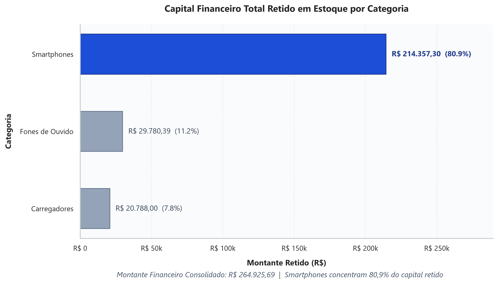
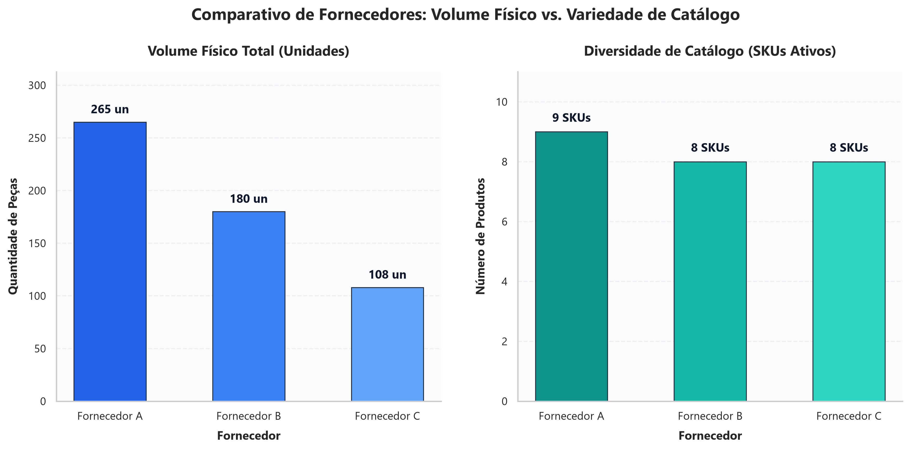
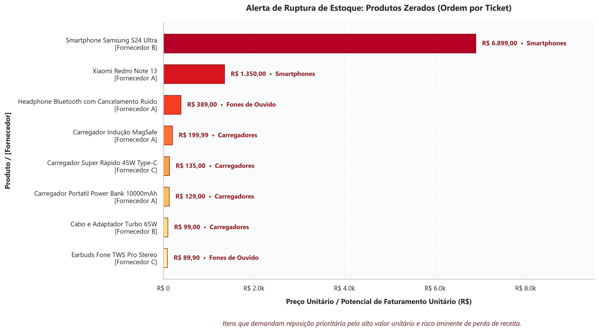

# 📦 Sistema Integrado de Engenharia de Dados, Análise e Monitoramento de Estoque

[](https://estoque-dashboard-live.streamlit.app)

> 🚀 **Dashboard em Produção:** Acesse a aplicação interativa em tempo real: [estoque-dashboard-live.streamlit.app](https://estoque-dashboard-live.streamlit.app)


Solução modular e automatizada de **Engenharia e Análise de Dados** ponta a ponta desenvolvida em **Python** e **Pandas**, com persistência relacional no **Neon PostgreSQL (Cloud)** com **SQLAlchemy**, orquestração completa do pipeline de ETL, geração de relatórios executivos e disponibilização de um dashboard interativo em tempo real hospedado no **Streamlit Community Cloud**. O sistema realiza data profiling, higienização, mapeamento para schema canônico, carga em **Star Schema**, cálculo de indicadores financeiros e detecção de rupturas de estoque a partir de fontes de múltiplos fornecedores.


---


## 🎯 Problema de Negócio


Em ambientes de varejo e comércio eletrônico com múltiplos parceiros de abastecimento, a centralização dos dados de estoque enfrenta obstáculos críticos devido à **heterogeneidade e falta de governança na origem dos arquivos**.


Neste projeto, três fornecedores distintos (**Fornecedor A, Fornecedor B e Fornecedor C**) fornecem diariamente os seus catálogos de produtos com graves problemas de qualidade de dados:


* **Formatos e Schemas Distintos:** Nomes de colunas despadronizados para representar as mesmas entidades (por exemplo: `id_produto` vs `codigo_item` vs `sku`; `preco_unitario` vs `Preco` vs `valor_brl`; `qtd_estoque` vs `Quantidade` vs `estoque_disponivel`).

* **Erros de Digitação e Variações Textuais:** Nomes de produtos e departamentos escritos com erros de digitação e caixas variadas (`"Smartfone"`, `"smarthphone"`, `"FONE DE OUVIDO"`, `"audio / fone ouvido"`, `"Indussão"`, `"bluetoth"`).

* **Divergências de Moeda e Tipos Corrompidos:** Preços inseridos como texto com símbolo de moeda (`"R$ 4.299,00"`), separadores de milhar com ponto e decimais com vírgula, strings com instruções não numéricas (`"consultar"`) e quantidades acompanhadas de texto (`"15 un"`, `"30.0"`).

* **Registros Nulos e Valores Inválidos:** Itens com preços ausentes ou zerados (`0,00`), campos de categoria vazios (`NaN`) e quantidades em estoque negativas (`-3`, `-10`, `-1`) ou registradas como `"SEM ESTOQUE"`.


**Objetivo:** Construir um pipeline resiliente e auditável em Python que converta arquivos heterogêneos e inconsistentes em uma base única e fidedigna (Single Source of Truth), alimente um banco relacional em nuvem (PostgreSQL / Neon) sob modelagem dimensional e disponibilize camadas visuais de consumo analítico para suporte à decisão.


---


## 🏗️ Estrutura de Pastas e Arquitetura


O pipeline segue um fluxo lógico desacoplado e modular com arquitetura ponta a ponta conectada à nuvem:

```text
[dados_brutos/] (Fontes Despadronizadas)
       │
       ▼
[exploracao_diagnostico.py] (Profiling: dtypes, nulos, cabeçalhos)
       │
       ▼
[limpeza_padronizacao.py] (ETL: Schema Canônico, Regex, Coerção, Dedução)
       │
       ▼
[dados_processados/estoque_consolidado_limpo.csv] (Base Canônica SSOT)
       │
       ├──▶ [analise_negocio.py] ──▶ [dados_processados/resumo_kpis_categoria.csv]
       │
       ├──▶ [visualizacao_graficos.py] ──▶ [graficos/*.png] (Gráficos Executivos 300 DPI)
       │
       └──▶ [carregar_dados.py] ──▶ [Neon PostgreSQL (Cloud)]
                                            │
                                            ▼ (SQLAlchemy / Cache)
                                  [Streamlit Community Cloud]
                                  (estoque-dashboard-live.streamlit.app)
```

### 🛠️ Tecnologias Utilizadas e Nuvem

| Camada | Tecnologia | Finalidade no Projeto |
| :--- | :--- | :--- |
| **Linguagem & Manipulação** | Python 3.10+, Pandas | Engenharia de dados, profiling exploratório, pipeline de ETL e cálculo de KPIs |
| **Banco de Dados (Cloud)** | **Neon PostgreSQL (Cloud)** | Data Warehouse relacional serverless em nuvem com modelagem dimensional (*Star Schema*) |
| **Conectividade & ORM** | SQLAlchemy, psycopg2-binary | Gerenciamento de engine, pool de conexões e execução transacional segura |
| **Dashboard & Visualização Interativa** | Streamlit, Plotly Express | Aplicação analítica com filtros dinâmicos, métricas executivas e gráficos interativos |
| **Deploy & Hospedagem em Nuvem** | **Streamlit Community Cloud** | Hospedagem contínua, CI/CD integrado ao GitHub e disponibilização pública da aplicação |
| **Visualização Executiva** | Matplotlib, Seaborn | Geração de gráficos estáticos em alta resolução (300 DPI) para relatórios |
| **Configuração & Controle de Versão** | python-dotenv, Git, GitHub | Gestão segura de variáveis de ambiente (`.env`) e controle de versão do código |

### Estrutura do Diretório do Projeto:

```text
pipeline-analise-estoque-python/
│
├── dados_brutos/                          # Arquivos CSV brutos enviados pelos fornecedores
│   ├── fornecedor_a.csv
│   ├── fornecedor_b.csv
│   └── fornecedor_c.csv
│
├── dados_processados/                     # Dados tratados e resumos analíticos exportados
│   ├── estoque_consolidado_limpo.csv
│   └── resumo_kpis_categoria.csv
│
├── graficos/                              # Gráficos executivos gerados em alta resolução
│   ├── valor_por_categoria.png
│   ├── distribuicao_estoque_fornecedor.png
│   └── alerta_ruptura_estoque.png
│
├── gerar_dados_brutos.py                  # Script de simulação de dados e inconsistências
├── exploracao_diagnostico.py              # Script de diagnóstico exploratório e profiling
├── limpeza_padronizacao.py                # Pipeline de higienização, mapeamento e consolidação
├── analise_negocio.py                     # Cálculo de KPIs financeiros e detecção de rupturas
├── visualizacao_graficos.py               # Visualização e renderização gráfica executiva
│
├── criar_tabelas.py                       # DDL: Provisionamento de schemas, tabelas e constraints SQL
├── carregar_dados.py                      # Ingestão dimensional com Upsert no Neon PostgreSQL
├── consultar_banco.py                     # Auditoria pós-carga e consultas SQL analíticas
├── pipeline_completo.py                   # Orquestrador mestre automatizado de ponta a ponta
├── app.py                                 # Painel interativo em tempo real via Streamlit
│
├── requirements.txt                       # Dependências do ambiente Python
├── .env                                   # Variáveis de ambiente e credenciais (DATABASE_URL)
├── .gitignore                             # Regras de exclusão do Git
└── README.md                              # Documentação principal do projeto
```


---


## ⚙️ Decisões de Engenharia de Dados


1. **Padronização para Schema Canônico:**

   * Mapeamento explícito das colunas heterogêneas para o padrão unificado: `id_produto`, `produto`, `categoria`, `preco`, `estoque`, `fornecedor`.

   * Preservação da rastreabilidade da origem através da injeção do metadado de fornecedor.


2. **Coerção Numérica e Limpeza de Preços:**

   * Utilização de expressões regulares para remoção do prefixo monetário `R$` e de separadores de milhar no padrão brasileiro (`.` antecedendo 3 dígitos).

   * Substituição da vírgula decimal pelo ponto flutuante padrão do Python.

   * Aplicação de `pd.to_numeric(..., errors='coerce')` para converter textos (ex.: `"consultar"`) em `NaN`.

   * **Auditoria de Descarte:** Registros com preços nulos ou `<= 0` (como itens em revisão a `0,00`) foram removidos com log detalhado, uma vez que preços financeiros não devem ser inventados sem regras de negócio acordadas.


3. **Tratamento de Estoques e Valores Negativos:**

   * Limpeza de sufixos de texto (ex.: `"15 un"`) e mapeamento de valores como `"SEM ESTOQUE"` para `0`.

   * Coerção numérica e retificação de quantidades negativas (`-3`, `-10`, `-1`) para `0` através de `.clip(lower=0)`, saneando inconsistências físicas de estoque.


4. **Normalização de Categorias com Expressões Regulares (Dedução Inteligente):**

   * Normalização de caixas e caracteres para um conjunto fechado de **3 categorias canônicas**: `Smartphones`, `Fones de Ouvido` e `Carregadores`.

   * Quando o campo de categoria se encontrava nulo (`NaN`) ou genérico, o pipeline deduziu automaticamente a categoria através de padrões textuais e expressões regulares aplicados ao nome do produto (ex.: termos como *"Galaxy"*, *"iPhone"*, *"Edge"* e *"Redmi"* classificam automaticamente o produto como *Smartphones*).


5. **Modelagem Dimensional e Armazenamento (PostgreSQL / Neon):**
   * Isolamento lógico em schema dedicado (`core`) para governança analítica.
   * Arquitetura em *Star Schema* composta por tabelas de dimensões (`core.dim_categorias`, `core.dim_produtos`) e tabela de fatos (`core.fato_estoque`).
   * Aplicação de regras de integridade defensiva via `CHECK constraints` (`preco_unitario >= 0`, `quantidade_disponivel >= 0`) e garantia de idempotência através de operações de *Upsert* (`ON CONFLICT (sku) DO UPDATE`).


6. **Orquestração Automatizada com Logging Estruturado:**
   * Script centralizador (`pipeline_completo.py`) responsável pelo encadeamento sequencial de todas as fases, desde a simulação de origem até a carga relacional e auditoria.
   * Gestão de execução com métricas de tempo por módulo, rastreamento de falhas com aborto controlado e geração de logs em níveis `INFO` e `ERROR`.


---


## 📊 Indicadores e Métricas Obtidas


A base de dados higienizada consolidou **25 produtos ativos** (com 5 descartes justificados por ausência de preço válido):


### 1. Resumo Executivo Geral

| Indicador de Negócio | Valor Consolidado |

| :--- | :--- |

| **Total de SKUs Válidos** | 25 produtos |

| **Volume Total Físico em Estoque** | 553 unidades |

| **Preço Médio Global** | R$ 1.482,00 |

| **Capital Total Retido em Estoque** | **R$ 264.925,69** |

| **Itens em Ruptura de Estoque (Estoque Zerado)** | 8 SKUs |


### 2. Concentração de Valor por Categoria

| Categoria | SKUs | Unidades em Estoque | Preço Médio | Capital Retido (R$) | Participação (%) |

| :--- | :---: | :---: | :---: | :---: | :---: |

| 📱 **Smartphones** | 9 | 65 | R$ 3.816,03 | **R$ 214.357,30** | **80,91%** |

| 🎧 **Fones de Ouvido** | 9 | 218 | R$ 210,88 | R$ 29.780,39 | 11,24% |

| 🔌 **Carregadores** | 7 | 270 | R$ 115,41 | R$ 20.788,00 | 7,85% |


> **Destaque Estratégico:** Os **Smartphones** representam **80,91% de todo o capital imobilizado** da operação, embora correspondam a apenas 11,7% das unidades físicas totais.


### 3. Identificação de Rupturas de Estoque (Alerta de Reposição)

Foram identificados **8 produtos com estoque zerado**, demandando reposição imediata para evitar perda de receita, com destaque para itens premium:

* **Samsung Galaxy S24 Ultra** (`B-109` - Fornecedor B): Preço Unitário de **R$ 6.899,00**

* **Xiaomi Redmi Note 13** (`FA008` - Fornecedor A): Preço Unitário de **R$ 1.350,00**

* **Headphone Bluetooth ANC** (`FA006` - Fornecedor A): Preço Unitário de **R$ 389,00**


---


## 📈 Demonstração e Visualização

A camada de visualização do projeto é composta por duas frentes complementares: um **dashboard interativo em nuvem** para tomada de decisão em tempo real e um conjunto de **gráficos executivos estáticos** para relatórios e apresentações gerenciais.

---

### 1. 🖥️ Dashboard Interativo em Produção (Streamlit Community Cloud)

[](https://estoque-dashboard-live.streamlit.app)

> 🌐 **Acesso Online:** [estoque-dashboard-live.streamlit.app](https://estoque-dashboard-live.streamlit.app)

A aplicação web interativa foi implantada em produção no **Streamlit Community Cloud** e consome as métricas e tabelas consolidadas diretamente da instância em nuvem do **Neon PostgreSQL (Cloud)** através do **SQLAlchemy**:

* **Integração em Nuvem com SQLAlchemy:** O painel estabelece conexão gerenciada com o banco Neon via `create_engine` e gerencia o ciclo de vida da conexão através do decorador `@st.cache_resource`.
* **Consultas Analíticas Otimizadas:** As métricas são consultadas na tabela fato (`core.fato_estoque`) com junção nas dimensões de produtos (`core.dim_produtos`) e categorias (`core.dim_categorias`), utilizando a sintaxe `DISTINCT ON (p.sku)` ordenada pela carga mais recente (`data_carga DESC`).
* **Cache Inteligente de Baixa Latência:** O carregamento dos dados utiliza `@st.cache_data(ttl=60)`, assegurando tempo de resposta instantâneo aos usuários simultâneos sem sobrecarregar a infraestrutura do banco.
* **Recursos do Painel:**
  * **Barra Lateral com Filtros Dinâmicos:** Filtro reativo por categoria de produto (*Todas*, *Smartphones*, *Fones de Ouvido*, *Carregadores*).
  * **Scorecards de KPIs em Tempo Real:** Total de SKUs cadastrados, volume físico de itens, preço médio global, capital total imobilizado e contagem de itens em ruptura de estoque.
  * **Gráficos Interativos (Plotly Express):** Gráfico de barras de valor retido por categoria e gráfico de pizza/rosca detalhando a proporção de produtos com *Estoque Regular* vs. *Reposição Necessária*.
  * **Tabela Analítica Completa:** Visualização detalhada dos itens filtrados com badges visuais de status, formatação monetária em padrão brasileiro (R$) e ordenação dinâmica por valor imobilizado.

---

### 2. 📊 Relatórios Gráficos Executivos (300 DPI)

Gráficos executivos gerados via `matplotlib` e `seaborn`, utilizando paleta profissional e formatação em moeda nacional:

#### 1. Valor Financeiro por Categoria


#### 2. Comparativo de Fornecedores (Volume Físico vs. SKUs Ativos)


#### 3. Alerta de Ruptura de Estoque (Produtos Zerados por Ticket)


---

## 🚀 Instruções de Execução

Siga o passo a passo abaixo para clonar, configurar e executar todos os estágios do pipeline e o dashboard localmente:

### 1. Clonar o Repositório

```bash
git clone https://github.com/paulocid95/pipeline-analise-estoque-python.git
cd pipeline-analise-estoque-python
```

### 2. Configurar o Ambiente Virtual

* **No Windows (PowerShell):**
  ```powershell
  python -m venv .venv
  .venv\Scripts\Activate.ps1
  ```

* **No Linux / macOS:**
  ```bash
  python3 -m venv .venv
  source .venv/bin/activate
  ```

### 3. Instalar Dependências

```bash
pip install -r requirements.txt
```

### 4. Configurar as Variáveis de Ambiente (`.env`)

Crie um arquivo `.env` na raiz do projeto contendo a string de conexão do PostgreSQL Neon:

```env
DATABASE_URL="postgresql://<usuario>:<senha>@<host>/<database>?sslmode=require"
```

> **Nota:** Esta variável é consumida automaticamente pelos scripts de migração DDL (`criar_tabelas.py`), carga (`carregar_dados.py`), auditoria (`consultar_banco.py`) e pelo dashboard Streamlit (`app.py`).

### 5. Executar os Scripts na Ordem Correta

Para processar os dados locais e sincronizar com o banco relacional, execute:

```bash
# 1. Simular e criar os dados brutos com inconsistências (pasta dados_brutos/)
python gerar_dados_brutos.py

# 2. Executar o diagnóstico exploratório de dados e profiling de inconsistências
python exploracao_diagnostico.py

# 3. Executar o pipeline de limpeza, padronização e consolidação (salva em dados_processados/)
python limpeza_padronizacao.py

# 4. Calcular métricas financeiras de negócio, alertas de ruptura e exportar KPIs
python analise_negocio.py

# 5. Gerar e salvar os gráficos executivos em alta resolução (pasta graficos/)
python visualizacao_graficos.py

# 6. Provisionar o schema relacional e as tabelas com constraints no PostgreSQL
python criar_tabelas.py

# 7. Executar a ingestão dimensional com lógica de Upsert no banco de dados
python carregar_dados.py

# 8. Executar validações e consultas analíticas de auditoria
python consultar_banco.py
```

> 💡 **Execução Automatizada:** Você também pode rodar toda a esteira de uma única vez com o orquestrador unificado:
> ```bash
> python pipeline_completo.py
> ```

### 6. Iniciar o Dashboard Interativo Localmente

Para rodar o painel analítico localmente consumindo a base do Neon:

```powershell
streamlit run app.py
```

A aplicação será aberta automaticamente em seu navegador padrão no endereço `http://localhost:8501`.

> 🚀 **Prefere testar sem instalar nada?** Acesse a versão já implantada em produção no [Streamlit Community Cloud](https://estoque-dashboard-live.streamlit.app).


---


## 👨‍💻 Autor


Desenvolvido por **Paulo Cid**  

*Engenharia e Análise de Dados com Python, PostgreSQL & Streamlit*  

GitHub: [@paulocid95](https://github.com/paulocid95)